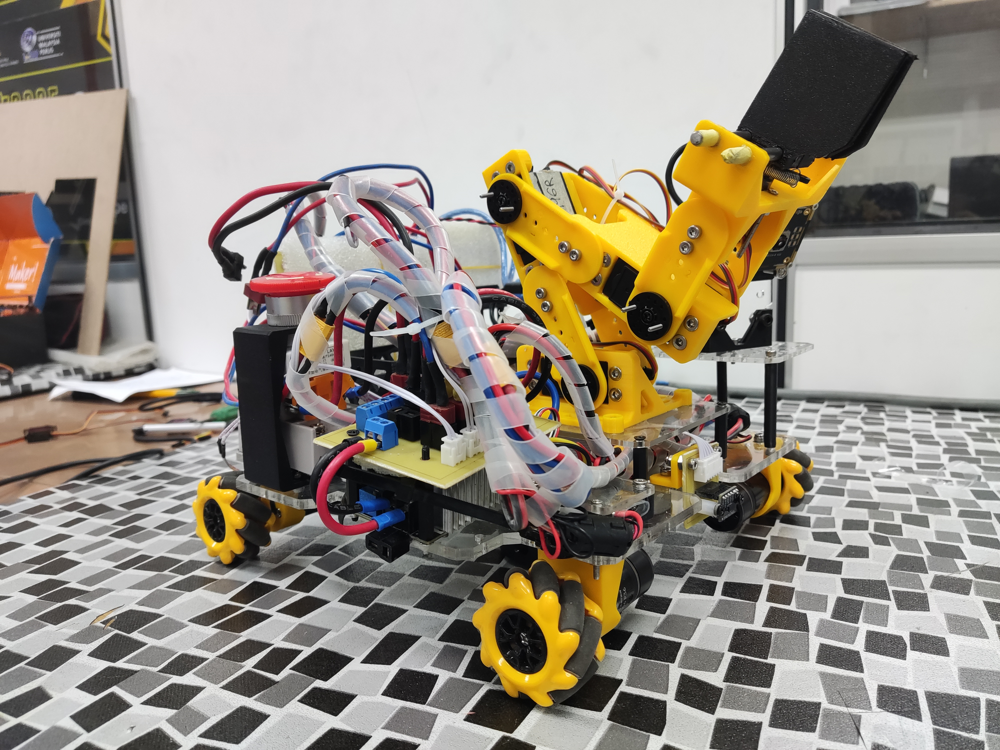
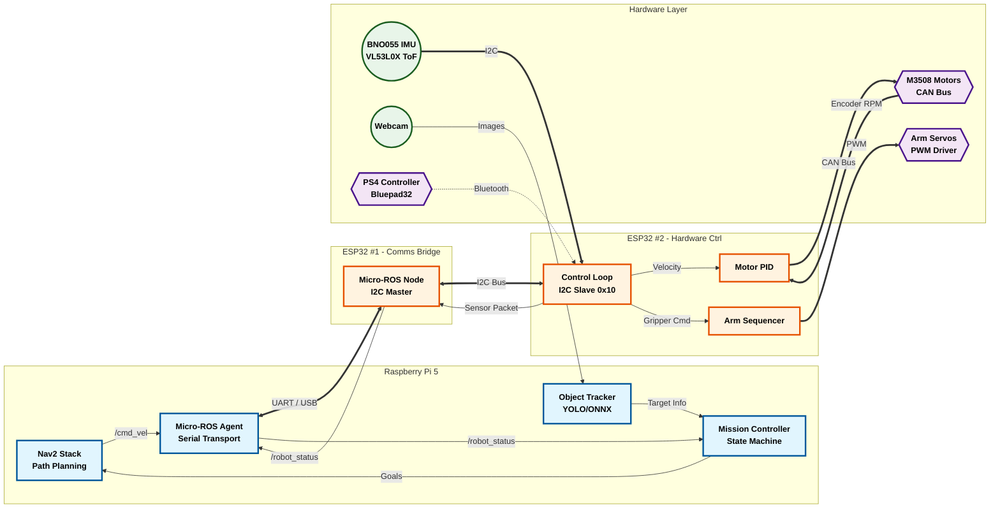
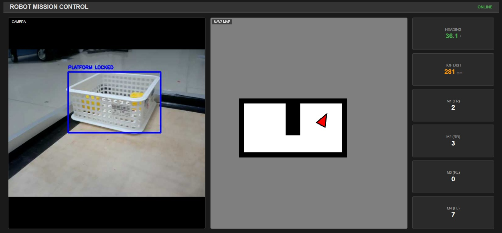

# 🤖 RBC26 - "ROS Baby" Autonomous Robot Stack

**Robocon 2026 Autonomous Robot Controller**


<p align="center">
  
</p>

## 📖 Overview

This repository contains the complete source code for **"ROS Baby"**, an autonomous mecanum-drive robot designed for the **Robocon 2026** competition.

The system is built on **ROS 2 Jazzy** and features a sophisticated autonomous stack capable of:
1.  **Precision Navigation:** Using the **Nav2** stack with custom costmap tuning for tight spaces.
2.  **AI Object Detection:** Real-time YOLO/ONNX tracking for Cubes and Platforms.
3.  **Robust Mission Control:** A finite state machine (FSM) with **"Self-Healing" recovery logic** to handle navigation failures and grasp retries automatically.
4.  **Hardware Fusion:** Seamless integration with **Micro-ROS (ESP32)** for real-time motor control and sensor fusion (Lidar + IMU + Encoders).

This project demonstrates a fully closed-loop system where Vision, Navigation, and Manipulation handshake to complete "Pick and Place" tasks autonomously.

---

## 🏗️ Hardware & Software Architecture

### 🔧 Hardware Specs
* **Drive System:** 4-Wheel Mecanum Drive (Holonomic motion).
* **Sensors:**
    * **Lidar:** RPLidar A1 (2D Laser Scan for mapping/AMCL).
    * **Vision:** USB Webcam (640x480 @ 30fps).
    * **IMU:** BNO055 (Absolute Orientation).
    * **Distance:** VL53L0X Time-of-Flight (ToF) sensor for precision docking.
* **Compute Architecture:**
    * **Main Computer:** **Raspberry Pi 5** (Running ROS 2 & Vision).
    * **Communication MCU:** ESP32 (Micro-ROS Node & I2C Master).
    * **Control MCU:** ESP32 (Hardware Driver, PID, CAN Bus & I2C Slave).

### 💻 Software Stack
* **OS:** Ubuntu 24.04 (Noble Numbat).
* **Middleware:** ROS 2 Jazzy Jalisco + Micro-ROS.
* **Navigation:** Nav2 (SmacPlanner + Graceful Controller).
* **AI/Vision:** ONNX Runtime (Custom trained YOLO models).

### 🔗 System Diagram

The system uses a **Distributed Control Architecture**. The Raspberry Pi handles high-level logic, while low-level tasks are split between two ESP32s communicating via I2C.



---

## 🚀 Installation & Setup

### 1. System Requirements
* **Computer:** Raspberry Pi 5 (8GB Recommended).
* **OS:** Ubuntu 24.04 (Noble Numbat).
* **ROS 2:** Jazzy Jalisco.

### 2. Install Dependencies
Install the required ROS 2 packages and Python libraries for AI/Vision.

```bash
# Update System
sudo apt update && sudo apt upgrade -y

# Install ROS 2 Navigation & SLAM packages
sudo apt install -y \
    ros-jazzy-navigation2 \
    ros-jazzy-nav2-smac-planner \
    ros-jazzy-slam-toolbox \
    ros-jazzy-laser-filters \
    ros-jazzy-robot-localization \
    ros-jazzy-tf2-tools \
    ros-jazzy-rmw-microxrcedds \
    ros-jazzy-micro-ros-agent

# Install Python dependencies for YOLO/ONNX
pip3 install onnxruntime-gpu opencv-python numpy
```

### 3. Clone & Build
Create the workspace and clone the repository.
```bash
mkdir -p ~/ros_baby/ros2_ws/src
cd ~/ros_baby/ros2_ws/src

# Clone this repository
git clone [https://github.com/zwll0911/RBC26_Ros_Baby.git](https://github.com/zwll0911/RBC26_Ros_Baby.git) .

# Clone Lidar Driver (if not included)
git clone [https://github.com/Slamtec/sllidar_ros2.git](https://github.com/Slamtec/sllidar_ros2.git)

# Build the workspace
cd ~/ros_baby/ros2_ws
colcon build --symlink-install
source install/setup.bash
```
### 4. Hardware Permissions (udev Rules)
To ensure the Lidar and ESP32 always show up on the correct USB ports, we use udev rules.
1. Check your USB devices: ls -l /dev/ttyUSB*
2. Create a rules file: sudo nano /etc/udev/rules.d/99-ros-baby.rules
3. Add the following lines (adjust idVendor and idProduct using lsusb if needed):
```bash
# RPLidar A1 -> /dev/ttyUSB1
KERNEL=="ttyUSB*", ATTRS{idVendor}=="10c4", ATTRS{idProduct}=="ea60", MODE:="0777", SYMLINK+="ttyUSB1"

# ESP32 Micro-ROS -> /dev/ttyUSB0
KERNEL=="ttyUSB*", ATTRS{idVendor}=="1a86", ATTRS{idProduct}=="7523", MODE:="0777", SYMLINK+="ttyUSB0"
```
```bash
sudo udevadm control --reload-rules && sudo service udev restart
```

---

## 🎮 Operating Modes

### 1. Mapping Mode (SLAM)
Use this mode to drive the robot manually and create a map of the arena.

```bash
# Terminal 1: Launch Robot & SLAM Toolbox
ros2 launch my_robot_controller bringup.launch.py slam:=True
```
* **Drive:** Use the PS4 controller (handled by ESP32) to drive the robot.
* **Save Map:** Once satisfied, save the map:
```bash
ros2 run nav2_map_server map_saver_cli -f src/my_robot_controller/config/map
```

### 2. Autonomous Mission Mode
Use this mode for the competition run. It loads the saved map and starts the Nav2 Stack and Mission Controller.

```bash
# Terminal 1: Launch Robot, Nav2, & Mission Control
ros2 launch my_robot_controller bringup.launch.py slam:=False
```

### 3. Triggering the Mission
The robot initializes in STATE_IDLE. To start the autonomous "Pick and Place" routine, publish the trigger command:

```bash
# Terminal 2: Send Start Command
ros2 topic pub /mission_trigger std_msgs/msg/String "data: 'start'" --once
```

---

## 🖥️ Web Control Dashboard

The robot hosts a lightweight HTML5/JS dashboard for remote monitoring and debugging. This eliminates the need for heavyweight tools like RViz on the client machine.

<p align="center"></p>

### Features
* **Live Camera Feed:** Low-latency MJPEG stream via `web_video_server`.
* **Real-time Map:** Renders the Nav2 Costmap and AMCL pose using `ros2djs`.
* **Telemetry:** Live display of Heading (IMU), ToF Distance, and Motor RPMs.
* **Status Indicators:** Visual confirmation of connection state.

### How to Use
  1. Ensure `rosbridge_server` is running (Started automatically by `robot.launch.py`).
  2. Open `gui/index.html` in any web browser on the same network.
  3. Edit `const ROBOT_IP = '192.168.1.168';` in the HTML file to match your Raspberry Pi's IP.

## 🧠 Key Nodes & Logic

### 1. Mission Controller (`mission_controller.py`)
The "Brain" of the operation. This node implements a **Finite State Machine (FSM)** to manage the robot's lifecycle.

* **State Logic:** Transitions between Navigation, Searching, Visual Servoing, and Gripper Actions.
* **Self-Healing Navigation:** If Nav2 fails (e.g., "Start Occupied" error), the robot triggers a **Recovery Mode**:
    1.  Calls `ClearEntireCostmap` services to wipe "ghost" obstacles.
    2.  Performs a **"Blind Backup"** (reverses -0.20 m/s for 1 second) to physically escape the costmap inflation zone.
    3.  Retries the navigation goal up to 3 times before aborting.
* **Smart Pick Retry:** If the vision system detects the cube is *still there* after a pick attempt, the robot:
    1.  Resets the gripper.
    2.  Backs up to a safe distance.
    3.  Restarts the approach sequence.

### 2. Object Tracker (`tracker_node.py`)
The "Eyes" of the robot. Uses **ONNX Runtime** to run custom YOLO models on the Raspberry Pi 5 CPU.

* **Models:** Loads `mrc_yellow_cude_320.onnx` and `platform_4.onnx`.
* **Sticky Tracking:** Implements a "nearest neighbor" check to ensure the robot tracks one specific target and doesn't jitter between multiple objects.
* **Smoothing:** Applies an **Exponential Moving Average (EMA)** to bounding box coordinates to reduce noise before sending data to the motion controller.
* **Efficiency:** The camera loop sleeps when `vision_mode == 0` (Idle) to save CPU resources for Navigation.

### 3. Odometry Node (`odometry_node.py`)
The "Inner Ear". Since Mecanum wheels are prone to slipping, relying solely on encoders is inaccurate.

* **Sensor Fusion:** Combines Wheel Encoder RPM (for linear velocity) with **BNO055 IMU** (for absolute heading).
* **Kinematics:** Calculates linear X/Y velocity from the 4 motors using Mecanum kinematic formulas.
* **Output:** Publishes the `odom -> base_link` TF transform at **20Hz** to ensure smooth Nav2 performance.

---

## ⚙️ Navigation Configuration (Nav2)

The `nav2_params.yaml` file configures the robot to act as a **Differential Drive** vehicle during autonomous missions, even though it physically has Mecanum wheels. This constraint ensures higher accuracy and stability by avoiding lateral slippage.

### 1. Planner Server (`nav2_smac_planner`)
Responsible for calculating the global path from the robot's current position to the goal.
* **Plugin:** `SmacPlanner2D`
* **Motion Model:** `DUBINS`. This is critical. It restricts the planner to generate **car-like, curve-based paths** (Forward and Turn only). It prevents the robot from trying to strafe sideways, which is handled manually but disabled for autonomous accuracy.

### 2. Controller Server (`nav2_graceful_controller`)
Responsible for executing the local path and sending velocity commands (`cmd_vel`) to the hardware.
* **Plugin:** `GracefulController`
* **Function:** A control law designed specifically for **differential drive** robots. It generates smooth, fluid motions that orient the robot towards the path, minimizing jerky rotation-in-place movements that often confuse AMCL localization.

### 3. Costmaps (Global & Local)
These layers define where the robot can and cannot go.
* **Global Costmap:** Covers the static map (SLAM) and is used by the Planner.
* **Local Costmap:** A rolling window (3x3m) that updates via Lidar to avoid dynamic obstacles.

**Key Parameters:**
* **Footprint:** defined as a square `[[0.22, 0.22], [0.22, -0.22], ...]`. This tells the planner exactly where the corners are, allowing the robot to turn near walls without triggering collision safety stops.
* **Inflation Layer (Cost Scaling = 3.0):** Creates a gentle cost gradient around obstacles. This allows the differential drive controller to cut corners tightly if necessary without getting "scared" by the walls.

### 4. Behavior Server
Manages recovery behaviors.
* **Spin:** Rotates in place.
* **BackUp:** Reverses linearly (no strafing) to clear a stuck condition.


## 📦 Topics Interface

| Topic | Type | Direction | Description |
| :--- | :--- | :--- | :--- |
| `/cmd_vel` | `geometry_msgs/Twist` | **Pub** | Velocity commands. **Note:** Only `linear.x` and `angular.z` are used in Auto mode (Differential Drive). |
| `/robot_status` | `Float32MultiArray` | **Sub** | Feedback from ESP32: `[Heading, ToF_Dist, M1_RPM, ... M4_RPM]`. |
| `/gripper_cmd` | `Int32` | **Pub** | Gripper State: `0`=Relax, `1`=Pick, `2`=Place, `3`=Reset. |
| `/vision_mode` | `Int32` | **Pub** | Vision State: `0`=Idle, `1`=Track Cube, `2`=Track Platform. |
| `/target_info` | `Float32MultiArray` | **Sub** | Vision Data: `[Found_Flag, Error_X, Box_Width]`. |
| `/mission_trigger`| `String` | **Sub** | Send `"start"` to this topic to begin the FSM sequence. |

---

## 🐛 Troubleshooting

### 1. "Start Occupied" Error
* **Symptom:** The robot refuses to move, and the terminal says the robot is in a collision state immediately.
* **Fix:** The `footprint_padding` in `nav2_params.yaml` is likely too high. We set it to `0.01` to prevent the software from artificially "bloating" the robot size into the walls.

### 2. Robot Spins but Doesn't Move (Auto)
* **Symptom:** Nav2 generates a path, the robot rotates to face it, but never drives forward.
* **Fix:** Check `progress_checker` in `nav2_params.yaml`. The `required_movement_radius` might be too aggressive. Also ensure `odom` TF is publishing correctly.

### 3. Vision Lag / Low FPS
* **Symptom:** The camera feed is delayed.
* **Fix:** The `tracker_node.py` is heavy. Ensure the Raspberry Pi is in performance mode. The node automatically sleeps when `vision_mode` is 0 (Idle) to save resources for Navigation.

### 4. TF Data Too Old
* **Symptom:** Error `Transform timeout` or `Lookup would require extrapolation into the future`.
* **Fix:** This is usually a time sync issue between the Micro-ROS Agent and the PC. Restart the agent:
    ```bash
    ros2 run micro_ros_agent micro_ros_agent udp4 --port 8888
    ```
    And ensure `use_sim_time` is `False` in all launch files.

---

## 📜 License
This project is licensed under the Apache 2.0 License.

**Robocon 2026 Team**
